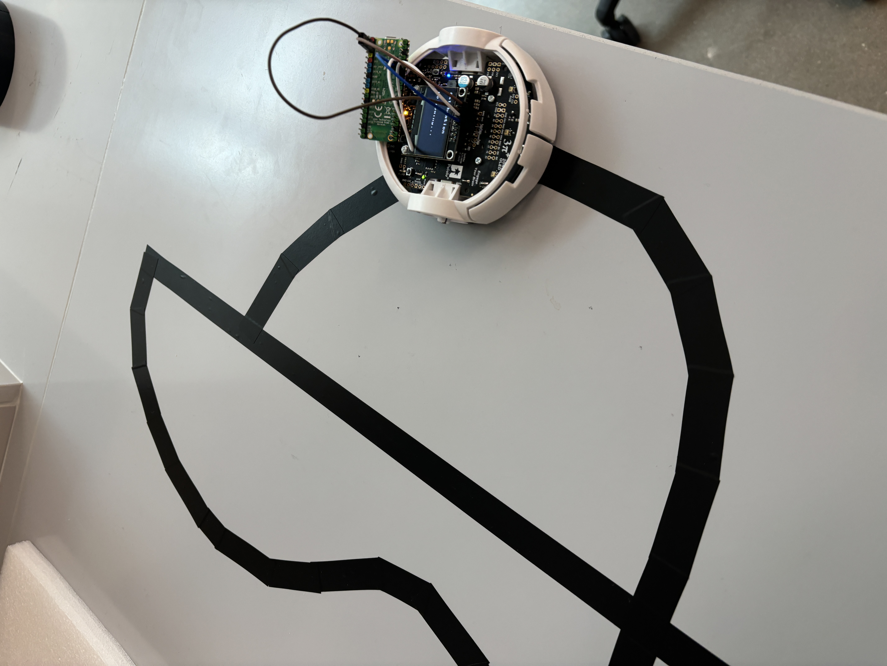

# Line Following Pololu Robot with BLE Control: How to Set Up the Project

# Software Requirements 
- MicroPython for the Pico W2 and Pololu Robot (make sure to flash both devices with the latest firmware)
- MicroPython editor (Thonny is recommended) 
- BLE connector (LightBlue is recommended)

# Hardware Requirements 
- Raspberry Pi Pico W2

- Pololu 3pi+ 2040 Robot

- Line track (any line track with dark line and light background)

# Setup:

Step 1: Preparing the Robot

- Download the latest MicroPython Firmware for Pololu Robot and flash the device (while connected, you should see example programs if completed correctly)
- Upload the robot.py code in Thonny (make sure you have RP 2040 in devices connected and choose the right COM port)

Step 2: Preparing the Pico W2
- Download the latest MicroPython Firmware for the Pico W2
- Connect to the Pico W2 in the device list (again make sure you are on the right COM port, I recommend enabling multi-threading so you can edit two devices on different devices)
- Upload the Pico code

Step 3: Connecting the Robot and Pico W2 (over UART)

- Wire Pico W2 TX (GPIO 4) to Pololu 3pi+ RX (GPIO 29) 
- Wire Pico W2 RX (GPIO 5) to Poloy 3pi+ TX (GPIO 28) 
- Connect GND between the two, also provide power from the Pololy to the Pico W2

Step 4: Test the whole system

- Power on the robot, you should see a "Calibrating" message on the Robot's OLED, gentle roll between the dark lines and light background (for best accuracy)
- On the LightBlue app, check for the device called "PICO_ROBOT_BRIDGE_2" and connect to it
- In the write feature (on app), use the UTF-8 string converter and test various commands, all found in the source code
- Try the simple "STOP" command which will stop the robot for 5 seconds, then try the speed change commands "SPEED 3"(1-3)

Feel free to add your own additions, such as full AGV traffic control.

Check out the short report to see the methodology and structure behind the current setup.

